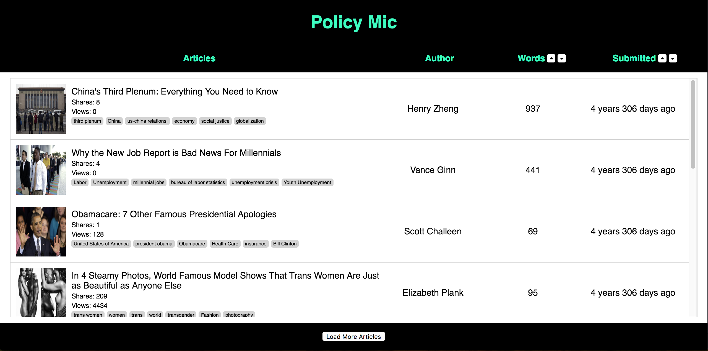

# Policy Mic
Welcome to Policy Mic! This app provides the user with a list of articles and allows them to request more articles and sort them by word count and time submitted.



## How to Use
Simply clone or download this repo, navigate into the folder in terminal, run npm install and then npm start, and that's it! Should you leave the page, simply return to localhost:3000 while npm start is still running.

## Technologies
This app uses React to create re-useable components and reference their state to seamlessly update the article list.

## Features
This app has three main features:
- Sort functionality
- The ability to "remember" a user's previous sort preference
- API retrieval of more articles

#### Sorting
Sorting is achieved by creating arrays of the articles and then adding them to state. The arrays have the length of the current number of requested articles, and having them instead allows the app to quickly render new lists as the user switches sorts.

```javascript
// Create arrays of articles sorted and reverse-sorted by word count
let wordsSortedArticles = [];
const wordsArticlesObjKeys = Object.keys(wordsArticlesObj);
wordsArticlesObjKeys.forEach(key => {
  wordsSortedArticles = wordsSortedArticles.concat(wordsArticlesObj[key]);
});
const wordsReverseSortedArticles = wordsSortedArticles.slice(0).reverse();

// Create arrays of articles sorted and reverse-sorted by submission
let submittedSortedArticles = [];
const submittedArticlesObjKeys = Object.keys(submittedArticlesObj).sort();
submittedArticlesObjKeys.forEach(key => {
  submittedSortedArticles = submittedSortedArticles.concat(submittedArticlesObj[key]);
});
const submittedReverseSortedArticles = submittedSortedArticles.slice(0).reverse();
```

#### Remembering User's Last Sort
The app updates local storage with the most recently used sort. The app looks for the saved sort when mounting and is able to load the correct list of articles.

```javascript
componentDidMount() {
  const savedSort = localStorage.getItem('savedSort');
  window.addEventListener("resize", this.recalculateULHeight);

  if (this.state.loadNumber === 0) {
    if (savedSort === null) {
      const newState = createArticleRows(1, articles, this.state);
      newState['loadNumber'] = 1;
      this.setState(newState);
    } else {
      const sortedArticles =  addSortedArticleListsToState(articles, savedSort, this.state);
      const newState = createArticleRows(1, sortedArticles, this.state);
      newState['loadNumber'] = 1;
      this.setState(newState);
    }
  }
}
```

#### Retrieve More Articles
To provide the user with a fast loading experience, the app is pre-populated with a small number of articles. Once the user has loaded all of those articles into their feed, clicking the load more button will make an XHR request to another JSON source.

This function runs to check if the user has loaded all of the pre-populated or "bootstrapped" articles. If they have, then the XHR request is made.
```javascript
export const getMoreArticles = (state) => {
  const newLoadNumber = state.loadNumber + 1;

  let newArticles;
  if (state.beyondBootStrap === false) {
    newArticles = createArticleRows(newLoadNumber, state.articles, state);
  } else if (moreArticlesXHRRequest(state).length !== 0) {
    newArticles = createArticleRows(newLoadNumber, moreArticlesXHRRequest(state), state);
  }
  return newArticles;
}
```
